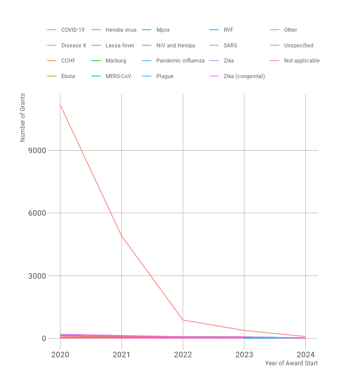
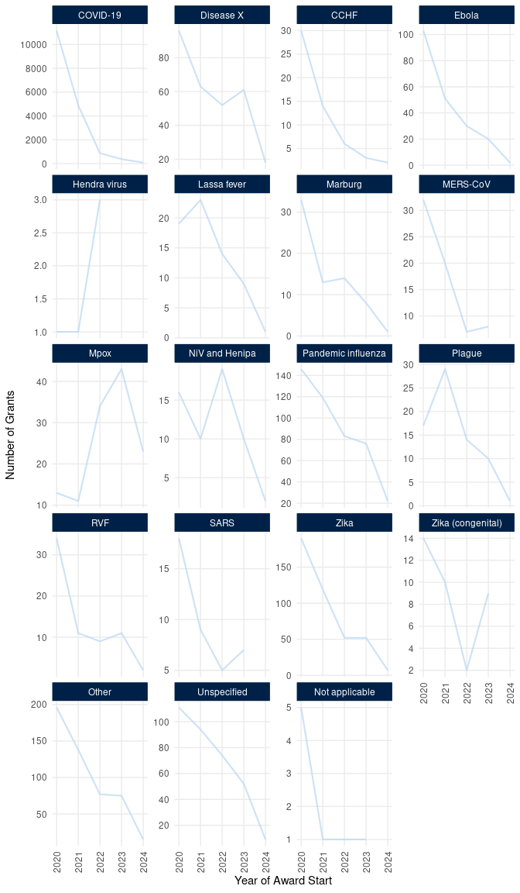

<!-- README.md is generated from README.Rmd. Please edit that file -->

# pactr: An Interface to the Pandemic PACT Data Repository 

<!-- badges: start -->

[](https://www.repostatus.org/#wip)
[](https://lifecycle.r-lib.org/articles/stages.html#experimental)
[](https://github.com/OxfordIHTM/pactr/actions/workflows/R-CMD-check.yaml)
[](https://github.com/OxfordIHTM/pactr/actions/workflows/test-coverage.yaml)
[](https://app.codecov.io/gh/OxfordIHTM/pactr?branch=main)
[](https://www.codefactor.io/repository/github/OxfordIHTM/pactr)
[](https://zenodo.org/badge/latestdoi/847474685)
<!-- badges: end -->

The [Pandemic PACT](https://www.pandemicpact.org/) monitors and analyses
global funding and research evidence related to diseases with pandemic
potential, as well as broader research preparedness efforts, and is
equipped to pivot in response to outbreaks. It collects, curates, codes,
and analyses data in alignment with WHO priority diseases and other
selected illnesses, including pandemic influenza, mpox, and plague.
Pandemic PACT aims to guide policy and decision-making for research
funders, policymakers, researchers, multilateral agencies. The Pandemic
PACT data is publicly available for download from its
[website](https://www.pandemicpact.org/) and from
[Figshare](https://portal.sds.ox.ac.uk/pandemicpact). This package
provides an application programming interface (API) to both the research
programme’s Figshare repository and website data download facility to
provide programmatic access to its publicly available tracker data along
with its other data products.

## What does `{pactr}` do?

`{pactr}` provides functions to interface programmatically with Pandemic
PACT’s data products either through its Figshare repository or its
website.

The functions for Figshare interface are wrappers to specific functions
of the [`{deposits}`
package](https://docs.ropensci.org/deposits/index.html) which provides
the underlying universal interface to various online research data
deposition services including Figshare. Current Figshare-specific
functionalities available in `{pactr}` are:

1.  Listing of outputs/assets available from the Pandemic PACT Figshare
    repository (*experimental*);

2.  Downloading of outputs/assets available from the Pandemic PACT
    Figshare repository (*experimental*);

3.  Reading of dataset outputs/assets available from the Pandemic PACT
    Figshare repository (*experimental*); and,

4.  Processing of Pandemic PACT data (*experimental*).

The functions for interfacing with the data available from the Pandemic
PACT website allow for downloading, reading, and processing. Current
website data-specific functionalities available in `{pactr}` are:

1.  Downloading of Pandemic PACT dataset available from the website
    (*stable*);

2.  Reading of Pandemic PACT dataset available from the website
    (*stable*); and,

3.  Processing of Pandemic PACT dataset available from the website
    (*experimental*).

## Motivation

The main motivation for the development of `{pactr}` is to create a
standardised programmatic interface to Pandemic PACT’s data for those
performing research or investigation relevant to Pandemic PACT’s
objectives. Standardised programmatic interface, in turn, allow for
reproducible scientific workflows based on the Pandemic PACT dataset.

## Installation

`{pactr}` is not yet on CRAN but can be installed through the [Oxford
IHTM r-universe](https://oxfordihtm.r-universe.dev) with:

``` r
install.packages(
  "pactr",
  repos = c("https://oxfordihtm.r-universe.dev", "https://cloud.r-project.org")
)
```

Alternatively, `{pactr}` can be installed directly from
[GitHub](https://github.com/OxfordIHTM/pactr) using the `{remotes}`
package with the following command:

``` r
if (!requireNamespace("remotes")) install.packages("remotes")
remotes::install_github("OxfordIHTM/pactr")
```

`{pactr}` can then be loaded for use with:

``` r
library(pactr)
```

## Usage - Figshare workflow

### Set a Figshare client

Usage of `{pactr}` always starts with the setting up of a Figshare
client. This requires creating a Figshare account and then creating a
personal access token [here](https://figshare.com/account/applications).

Once a Figshare token is created, it needs to be stored as a local
environment variable. This can be done using the following command in R:

``` r
Sys.setenv("FIGSHARE_TOKEN"="YOUR_TOKEN_HERE")
```

Once this token has been set as described above, the following command
can be run to setup a Figshare client:

``` r
pact_client <- pact_client_set()
```

Once a Figshare client has been setup, you can now perform the
functionalities provided by the `{pactr}` package.

### List outputs/assets

To list available outputs/assets from the Pandemic PACT Figshare
repository, issue the following command:

``` r
pact_list(pact_client)
```

The output is a `data.frame` containing metadata regarding contents of
the Figshare Pandemic PACT group. The information within the metadata
are those provided by [Figshare’s application programming interface
(API)](https://docs.figshare.com/) and are either set by the Pandemic
PACT data team or by Figshare. The data.frame would look as follows:

    #> # A tibble: 10 × 18
    #>    project_id      id title doi   handle url   published_date thumb defined_type
    #>         <int>   <int> <chr> <chr> <chr>  <chr> <chr>          <chr>        <int>
    #>  1     189177  2.72e7 mpox… 10.2… ""     http… 2024-10-04T10… "htt…            7
    #>  2     189177  2.72e7 Pand… 10.2… ""     http… 2024-10-02T11… "htt…            6
    #>  3     189177  2.71e7 mpox… 10.2… ""     http… 2024-09-26T13… "htt…            7
    #>  4     189177  2.70e7 Pand… 10.2… ""     http… 2024-09-12T16… "htt…            6
    #>  5     189177  2.68e7 Pand… 10.2… ""     http… 2024-08-20T17… "htt…            6
    #>  6         NA  2.58e7 Scop… 10.2… ""     http… 2024-05-15T12… ""               3
    #>  7         NA  2.54e7 test  10.2… ""     http… 2024-03-08T11… "htt…            1
    #>  8     189177  2.54e7 Pand… 10.2… ""     http… 2024-03-08T10… "htt…            1
    #>  9     189177  2.54e7 Exte… 10.2… ""     http… 2024-03-06T15… ""               6
    #> 10     189168  2.48e7 Pand… 10.2… ""     http… 2023-12-15T11… ""               3
    #> # ℹ 9 more variables: defined_type_name <chr>, group_id <int>,
    #> #   url_private_api <chr>, url_public_api <chr>, url_private_html <chr>,
    #> #   url_public_html <chr>, timeline <df[,2]>, resource_title <chr>,
    #> #   resource_doi <chr>

This function is useful in getting an overview of what is currently
available in the Pandemic PACT Figshare repository.

### Download outputs/assets

To download a specific output/asset - say the scoping review data - from
the Pandemic PACT Figshare repository, issue the following commands:

``` r
## Get the unique identifier for the scoping review data from Figshare ----
file_id <- pact_list(pact_client) |>
  subset(title == "Scoping Review Data", select = id) |>
  unlist()

pact_download_figshare(id = file_id, path = ".")
```

This will download the file `Scoping_Review-Data.xlsx` from the Pandemic
PACT Figshare repository into the current working directory.

### Read the Pandemic PACT tracker dataset and data dictionary

To read the Pandemic PACT tracker dataset into R, issue the following
command:

``` r
pact_read_figshare(pact_client)
```

which outputs a data.frame with 4637 records and 860 fields.

    #> # A tibble: 4,637 × 860
    #>    PactID Grant.Number Grant.Title.Original                      Grant.Title.Eng
    #>    <chr>  <chr>        <chr>                                     <chr>          
    #>  1 C00153 unknown      Serological studies to quantify SARS-CoV… "Serological s…
    #>  2 C00154 unknown      African COVID-19 Preparedness (AFRICO19)  "African COVID…
    #>  3 C00155 unknown      COVID-19 Intervention Modelling for East… "COVID-19 Inte…
    #>  4 C00156 unknown      The African coaLition for Epidemic Resea… "The African c…
    #>  5 C00157 unknown      Characterization of SARS-CoV-2 transmiss… "Characterizat…
    #>  6 C00158 unknown      Investigation of pre-existing immunity t… "Investigation…
    #>  7 C00159 unknown      A comprehensive study of immunopathogene… ""             
    #>  8 C00160 MC_PC_19012  Centre for Global Infectious Disease Ana… "Centre for Gl…
    #>  9 C00161 MC_PC_19025  ISARIC - Coronavirus Clinical Characteri… "ISARIC - Coro…
    #> 10 C00162 MC_PC_19026  MRC Centre for Virus Research (MRC CVR) … "MRC Centre fo…
    #> # ℹ 4,627 more rows
    #> # ℹ 856 more variables: Award.Amount.Converted <dbl>, Abstract.Eng <chr>,
    #> #   Laysummary <chr>, ODA.funding.used <chr>, Grant.Type <chr>,
    #> #   Grant.Start.Year <int>, Study.Subject..choice.Animals. <chr>,
    #> #   Study.Subject..choice.Bacteria. <chr>,
    #> #   Study.Subject..choice.Human.Populations. <chr>,
    #> #   Study.Subject..choice.Disease.Vectors. <chr>, …

This function reads the *labelled* tracker dataset by default. If the
raw dataset is required, then issue the following command:

``` r
pact_read_figshare(pact_client, tracker_type = "raw")
```

which outputs a data.frame with 4638 records and 860 fields.

    #> # A tibble: 4,638 × 860
    #>    pactid grant_number grant_title_original                      grant_title_eng
    #>    <chr>  <chr>        <chr>                                     <chr>          
    #>  1 SDS001 unknown      Dummy record                              "Dummy record" 
    #>  2 C00153 unknown      Serological studies to quantify SARS-CoV… "Serological s…
    #>  3 C00154 unknown      African COVID-19 Preparedness (AFRICO19)  "African COVID…
    #>  4 C00155 unknown      COVID-19 Intervention Modelling for East… "COVID-19 Inte…
    #>  5 C00156 unknown      The African coaLition for Epidemic Resea… "The African c…
    #>  6 C00157 unknown      Characterization of SARS-CoV-2 transmiss… "Characterizat…
    #>  7 C00158 unknown      Investigation of pre-existing immunity t… "Investigation…
    #>  8 C00159 unknown      A comprehensive study of immunopathogene… ""             
    #>  9 C00160 MC_PC_19012  Centre for Global Infectious Disease Ana… "Centre for Gl…
    #> 10 C00161 MC_PC_19025  ISARIC - Coronavirus Clinical Characteri… "ISARIC - Coro…
    #> # ℹ 4,628 more rows
    #> # ℹ 856 more variables: award_amount_converted <dbl>, abstract <chr>,
    #> #   laysummary <chr>, oda_funding_used <int>, grant_type <int>,
    #> #   grant_start_year <int>, study_subject___1 <int>, study_subject___2 <int>,
    #> #   study_subject___3 <int>, study_subject___4 <int>, study_subject___5 <int>,
    #> #   study_subject___6 <int>, study_subject____88 <int>,
    #> #   study_subject____99 <int>, study_subject____9999 <int>, …

### Process the Pandemic PACT tracker dataset

``` r
pact_read_figshare(pact_client) |>
  pact_process_figshare() |>
  tibble::tibble()
```

    #> # A tibble: 4,637 × 37
    #>    PactID Grant.Number Grant.Title.Original                      Grant.Title.Eng
    #>    <chr>  <chr>        <chr>                                     <chr>          
    #>  1 C00153 unknown      Serological studies to quantify SARS-CoV… "Serological s…
    #>  2 C00154 unknown      African COVID-19 Preparedness (AFRICO19)  "African COVID…
    #>  3 C00155 unknown      COVID-19 Intervention Modelling for East… "COVID-19 Inte…
    #>  4 C00156 unknown      The African coaLition for Epidemic Resea… "The African c…
    #>  5 C00157 unknown      Characterization of SARS-CoV-2 transmiss… "Characterizat…
    #>  6 C00158 unknown      Investigation of pre-existing immunity t… "Investigation…
    #>  7 C00159 unknown      A comprehensive study of immunopathogene… ""             
    #>  8 C00160 MC_PC_19012  Centre for Global Infectious Disease Ana… "Centre for Gl…
    #>  9 C00161 MC_PC_19025  ISARIC - Coronavirus Clinical Characteri… "ISARIC - Coro…
    #> 10 C00162 MC_PC_19026  MRC Centre for Virus Research (MRC CVR) … "MRC Centre fo…
    #> # ℹ 4,627 more rows
    #> # ℹ 33 more variables: Award.Amount.Converted <dbl>, Abstract.Eng <chr>,
    #> #   Laysummary <chr>, ODA.funding.used <chr>, Grant.Type <chr>,
    #> #   Grant.Start.Year <int>, Study.Subject <list>, Ethnicity <list>,
    #> #   Age.Groups <list>, Rurality <list>, Vulnerable.Population <list>,
    #> #   Occupational.Groups <list>, Study.Type <list>, Clinical.Trial <list>,
    #> #   report <chr>, Pathogen <list>, Pathogen.Specific <list>, Disease <list>, …

For a more detailed discussion of the usage and limitations of the
`{pactr}` Figshare functions, see this
[vignette](https://oxford-ihtm.io/pactr/articles/figshare-workflow.html).

## Usage - website data workflow

### Download the Pandemic PACT tracker dataset from the website

To download the Pandemic PACT tracker dataset available from its
website, the following command can be used:

``` r
## Save the dataset from website to a temporary directory ----
pact_download_website(path = tempdir())
```

which will return the path to the downloaded dataset:

    #> [1] "/tmp/Rtmp5QtSRK/pandemic-pact-grants.csv"

### Read the Pandemic PACT tracker dataset from the website

Instead of downloading, the Pandemic PACT dataset available from its
website can be read into R directly as follows:

``` r
pact_read_website()
```

which results in the following:

    #> # A tibble: 13,527 × 39
    #>    GrantID PubMedGrantId           GrantTitleEng Abstract PublicationYearOfAward
    #>    <chr>   <chr>                   <chr>         <chr>                     <int>
    #>  1 C00019  CCP-nCoV                "Cohort foll… "Cohort…                   2020
    #>  2 C00020  THERAMAB                "Identificat… "Identi…                   2020
    #>  3 C00021  None                    "Using socia… "Using …                   2020
    #>  4 C00024  A Toolbox for SARS-CoV… "Potentiatin… "Potent…                   2020
    #>  5 C00028  LAMBats                 "Live animal… "Live a…                   2020
    #>  6 C00030  Anti2019-nCoV           "Drug Reposi… "Strate…                   2020
    #>  7 C00032  unknown                 "AEC²-France… "The AE…                   2020
    #>  8 C00033  unknown                 "Perception … "Knowle…                   2020
    #>  9 C00034  unknown                 "In vitro an… "An int…                   2020
    #> 10 C00036  unknown                 "Science, In… "The pr…                   2020
    #> # ℹ 13,517 more rows
    #> # ℹ 34 more variables: GrantEndYear <int>, ResearchInstitutionName <chr>,
    #> #   StudySubject <chr>, Ethnicity <chr>, AgeGroups <chr>, Rurality <chr>,
    #> #   VulnerablePopulations <chr>, OccupationalGroups <chr>, StudyType <chr>,
    #> #   ClinicalTrial <chr>, Pathogen <chr>, InfluenzaA <chr>, InfluenzaH1 <chr>,
    #> #   InfluenzaH2 <chr>, InfluenzaH3 <chr>, InfluenzaH5 <chr>, InfluenzaH6 <chr>,
    #> #   InfluenzaH7 <chr>, InfluenzaH10 <chr>, Disease <chr>, …

### Process the Pandemic PACT tracker dataset from the website

The package includes functions that will process the Pandemic PACT
tracker dataset into specific structures and aggregations that will
allow for further plotting and reporting of similar outputs that are
currently presented in the Pandemic PACT website.

For example, the following will process the Pandemic PACT tracker
dataset into an aggregated dataset structure that can be used to create
a similar plot to the one presented in the
[website](https://www.pandemicimpact.org/visualise#disease).

``` r
pact_read_website() |>
  pact_process_website() |>
  pact_table_topic_group(topic = "Disease", group = "GrantStartYear")
```

which produces the following output:

    #> # A tibble: 88 × 5
    #>    GrantStartYear Disease         n_grants n_grants_specified grant_amount_total
    #>             <int> <chr>              <int>              <int>              <dbl>
    #>  1           2020 COVID-19            4711               3917        7165275210.
    #>  2           2020 Congenital Zik…       13                 12           6299449.
    #>  3           2020 Crimean-Congo …       30                 30          21675622.
    #>  4           2020 Disease X             89                 85         363603562.
    #>  5           2020 Ebola virus di…      101                 95          63300851.
    #>  6           2020 Hendra virus i…        1                  1             10059 
    #>  7           2020 Lassa fever           19                 18          19457036.
    #>  8           2020 Marburg virus …       33                 33          21701979.
    #>  9           2020 Middle East Re…       31                 31          30587054.
    #> 10           2020 Mpox                  11                  9          13115693 
    #> # ℹ 78 more rows

which in turn can be plotted as follows:



or alternatively:



For a more detailed discussion of the usage and limitations of the
`{pactr}` website dataset functions, see this
[vignette](https://oxford-ihtm.io/pactr/articles/website-dataset-workflow.html).

## Citation

To cite the `{pactr}` package, please use the suggested citation
provided by a call to the `citation()` function as follows:

``` r
citation("pactr")
#> To cite pactr in publications use:
#> 
#>   Ernest Guevarra (2024). _pactr: An Interface to the Pandemic PACT
#>   Repository_. R package version 0.0.9000,
#>   <https://oxford-ihtm.io/pactr/>.
#> 
#> A BibTeX entry for LaTeX users is
#> 
#>   @Manual{,
#>     title = {pactr: An Interface to the Pandemic PACT Repository},
#>     author = {{Ernest Guevarra}},
#>     year = {2024},
#>     note = {R package version 0.0.9000},
#>     url = {https://oxford-ihtm.io/pactr/},
#>   }
```

To cite the Pandemic PACT Tracker dataset, please use the suggested
citation provided by a call to the `pact_cite()` function as follows:

``` r
## cite the labelled version of the tracker dataset
pact_cite(pact_client, id = 24763548)  
#> To cite Pandemic PACT Grant Tracker (labelled) in publications use:
#> 
#>   Pandemic PACT team (2023). "Pandemic PACT Grant Tracker (labelled).
#>   dataset version 1." doi:10.25446/oxford.24763548.v1
#>   <https://doi.org/10.25446/oxford.24763548.v1>.
#> 
#> A BibTeX entry for LaTeX users is
#> 
#>   @Misc{,
#>     title = {Pandemic PACT Grant Tracker (labelled). dataset version 1},
#>     author = {{Pandemic PACT team}},
#>     year = {2023},
#>     doi = {10.25446/oxford.24763548.v1},
#>   }
```

## Community guidelines

Feedback, bug reports and feature requests are welcome; file issues or
seek support [here](https://github.com/OxfordIHTM/pactr/issues). If you
would like to contribute to the package, please see our [contributing
guidelines](https://oxford-ihtm.io/pactr/CONTRIBUTING.html).

This project is released with a [Contributor Code of
Conduct](https://oxford-ihtm/pactr/CODE_OF_CONDUCT.html). By
participating in this project you agree to abide by its terms.
